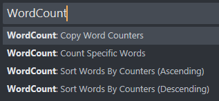
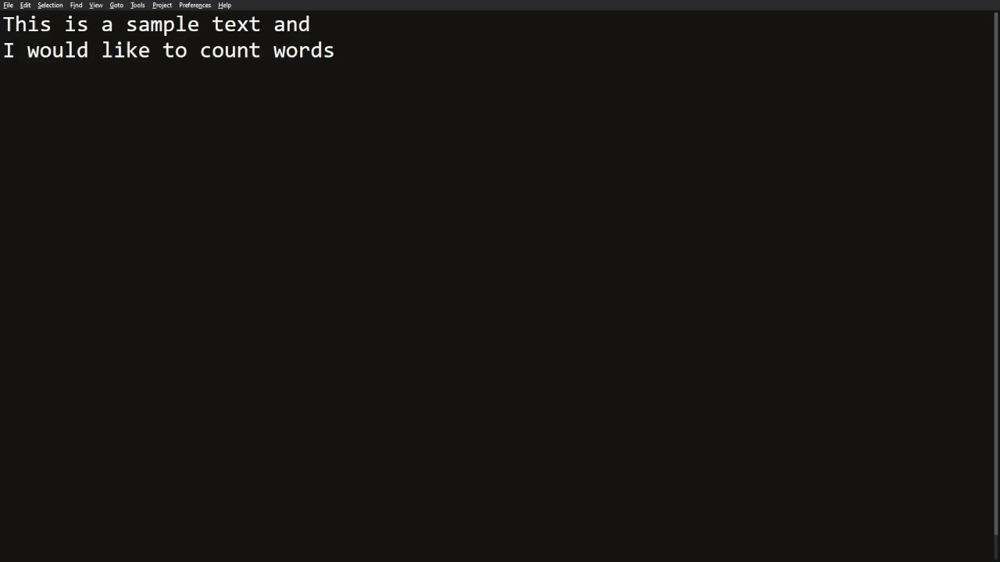

# Word Count
Sublime Text plugin written in Python that counts specific words given by the user.

## How to use?
From the Command Palette:

- `Count Specific Words` opens a panel on the right where the user can then enter words to be counted,
- `Copy Word Counters` from that same panel, copies all words and their counters into the clipboard,
- `Sort Words By Counters` sorts all words in an ascending or descending order based on the counters.

Here is a brief demo:

It's also possible to switch the `Whole word` and `Case sensitive` flags between 0 or 1 to disable or enable them respectively.

## Contributions/Suggestions
Contributions and suggestions are more than welcome as this is my first time writing a plugin for Sublime Text.

## Ideas/Improvements/Issues
Things I want to improve/fix:

- counting in a large file is quite demanding in terms of cpu
- make it so it doesn't recount after a sort

## Credits
I watched a few of OdatNurd's [youtube videos](https://www.youtube.com/playlist?list=PLGfKZJVuHW91zln4ADyZA3sxGEmq32Wse) to get started as well as google search (a lot) and use Sublime Text's [forum](https://forum.sublimetext.com/).
I also followed FichteFoll's [suggestions](https://github.com/wbond/package_control_channel/pull/8836) in order to improve the plugin's behavior.
